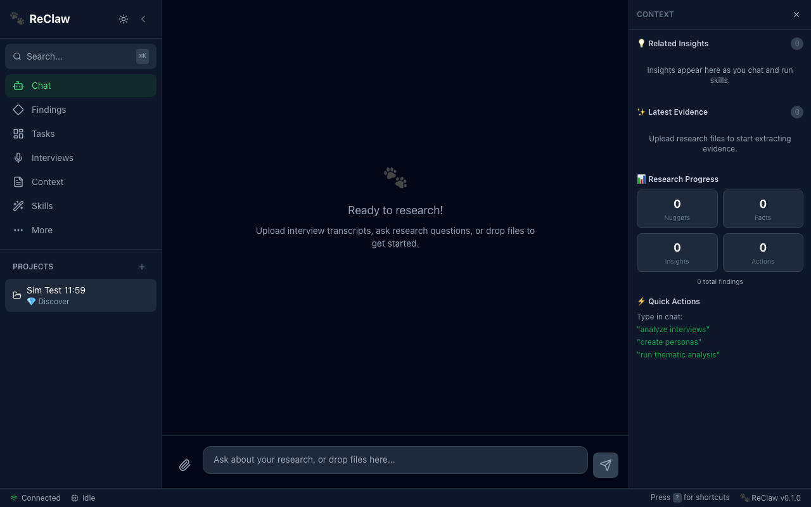
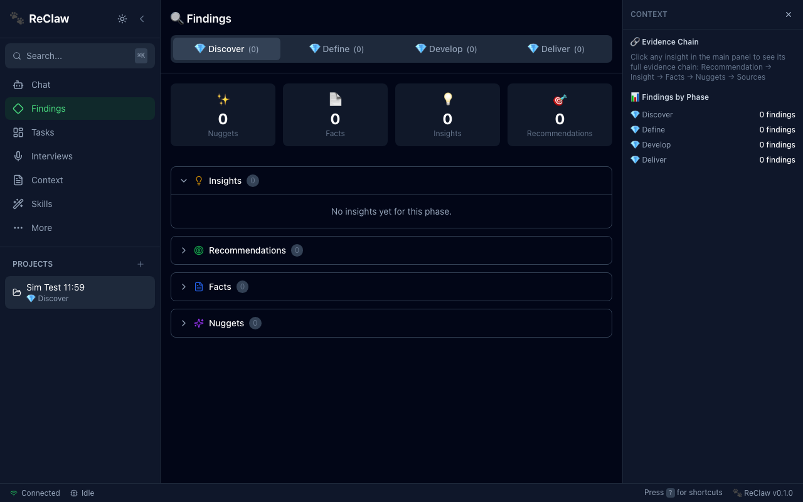
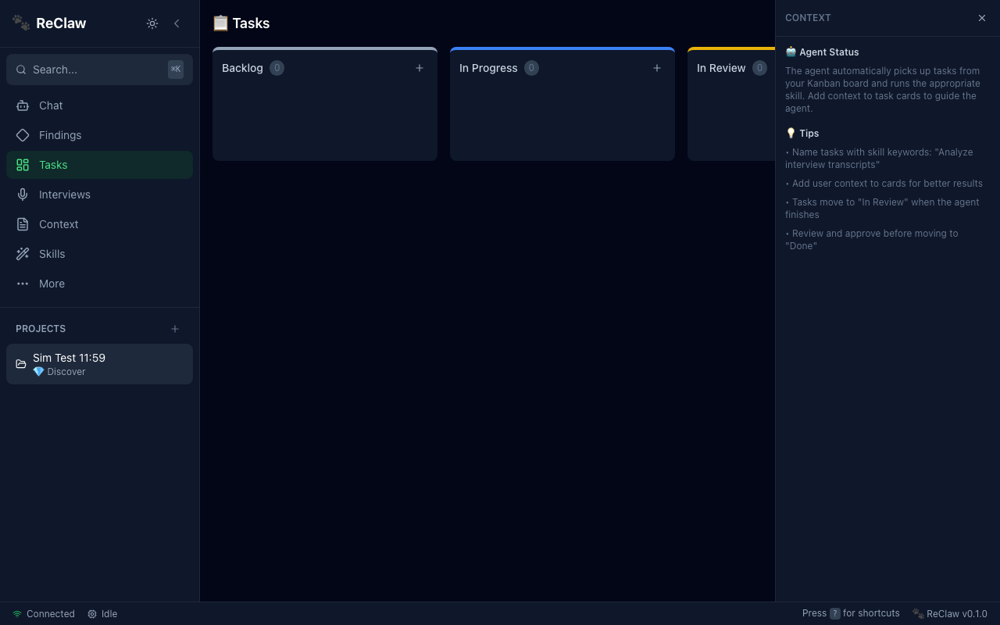
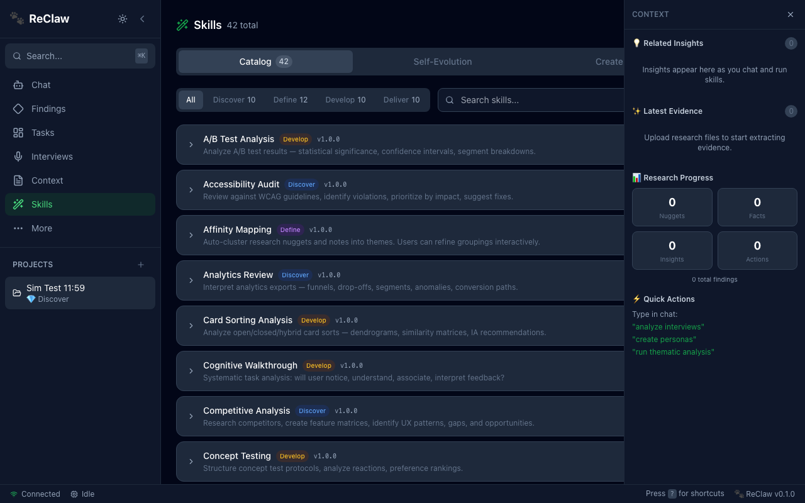
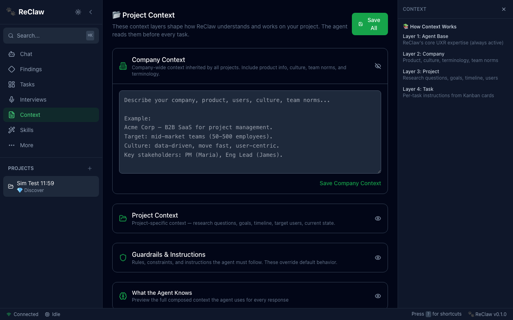
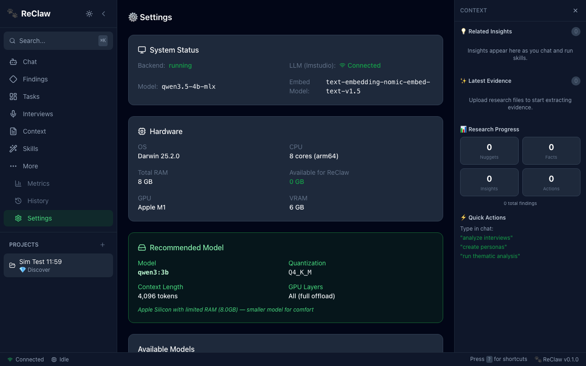

# ReClaw

**Local-first AI agent for UX Research.**

ReClaw is an open-source research assistant that runs entirely on your machine. It helps UX researchers organize, analyze, and synthesize research findings using local LLMs — no data ever leaves your computer.

> Think **OpenClaw meets Google NotebookLM meets commercial UXR platforms** — but running on your hardware, your models, your data.

[](LICENSE)

---

## Screenshots

### Chat — Conversational research assistant
Talk to the agent, drop files, trigger skills with natural language.



### Findings — Atomic Research organized by phase
Every insight traces back: Recommendations > Insights > Facts > Nuggets > Sources.



### Tasks — Kanban board for directing the agent
Create tasks, the agent picks them up and runs the appropriate skill.



### Skills — 42 UXR skills with self-evolution
Browse, search, edit, and create skills. Track how skills improve over time.



### Context — 6-layer hierarchy that guides the agent
Edit company, project, guardrails, and task context. The agent reads these before every response.



### Settings — Hardware-aware model management
Auto-detects your hardware and recommends the best model. Supports LM Studio and Ollama.



---

## Features

### AI-Powered Research
- **42 UXR skills** — qualitative and quantitative methods across the full Double Diamond
- **Atomic Research** — every insight traces back: Recommendations > Insights > Facts > Nuggets > Sources
- **RAG on local files** — ask questions about your research data with retrieval-augmented generation
- **Self-evolving skills** — ReClaw analyzes skill performance and proposes improvements automatically

### Beautiful Research UI
- **Chat** — conversational interface with skill execution ("analyze my interviews")
- **Findings** — organized by Double Diamond phase with evidence chain drill-down
- **Tasks** — Kanban board to direct the agent
- **Skills** — browse all 42 skills, edit prompts, track self-evolution, create custom skills
- **Interviews** — transcript viewer with nugget extraction and tag filtering
- **Metrics** — SUS, NPS, task completion dashboards with benchmarks
- **Context** — editable 6-layer hierarchy (platform > company > product > project > task > agent)
- **Search** — Cmd+K global search across all findings
- **History** — version tracking with rollback
- **Settings** — hardware info, model management, system status

### Local-First & Hardware-Aware
- **Data never leaves your machine** — everything runs locally
- **LM Studio + Ollama support** — choose your preferred LLM provider
- **Auto-detects hardware** — picks the best model & quantization for your RAM/GPU
- **Resource governor** — won't overwhelm your machine, reserves resources for other apps
- **Token budget management** — context window guard with automatic history trimming

### Multi-Agent System
- **Task Executor** — picks Kanban tasks, runs skills, stores findings
- **DevOps Audit** — monitors data integrity, system health
- **UI Audit** — heuristic evaluation, accessibility checking
- **UX Evaluation** — holistic platform experience assessment
- **User Simulation** — end-to-end API testing
- **Meta-Orchestrator** — coordinates all agents, prevents conflicts
- **Cron Scheduler** — schedule recurring skill executions with cron expressions
- **Multi-Channel Adapters** — extensible Slack, Telegram, and custom channel support

---

## Quick Start

### Prerequisites
- Python 3.11+
- Node.js 18+
- [LM Studio](https://lmstudio.ai/) or [Ollama](https://ollama.ai/)
- 8GB RAM minimum (16GB recommended)

### Setup

```bash
git clone https://github.com/henrique-simoes/ReClaw.git
cd ReClaw

# Backend
cd backend && pip install -e ".[dev]" && cd ..

# Frontend
cd frontend && npm install && cd ..

# Configure LLM provider
cp .env.example .env
# Edit .env to set LLM_PROVIDER=lmstudio or LLM_PROVIDER=ollama
```

### Run

```bash
# Start your LLM provider (LM Studio or Ollama)
lms server start          # LM Studio
# OR: ollama serve        # Ollama

# Backend
python -m uvicorn app.main:app --port 8000 --app-dir backend

# Frontend
cd frontend && npm run dev
```

Then open **http://localhost:3000**

### Docker (alternative)

```bash
cp .env.example .env
mkdir -p data/watch data/uploads data/projects data/lance_db
docker compose up
```

---

## 42 UXR Skills

### Discover (10 skills)
User Interviews, Contextual Inquiry, Diary Studies, Competitive Analysis, Stakeholder Interviews, Survey Design & Analysis, Analytics Review, Desk Research, Field Studies / Ethnography, Accessibility Audit

### Define (12 skills)
Affinity Mapping, Persona Creation, Journey Mapping, Empathy Mapping, JTBD Analysis, HMW Statements, User Flow Mapping, Thematic Analysis, Research Synthesis, Prioritization Matrix, Kappa Intercoder Thematic Analysis, Taxonomy Generator

### Develop (10 skills)
Usability Testing, Heuristic Evaluation, A/B Test Analysis, Card Sorting, Tree Testing, Concept Testing, Cognitive Walkthrough, Design Critique, Prototype Feedback, Workshop Facilitation

### Deliver (10 skills)
SUS/UMUX Scoring, NPS Analysis, Task Analysis, Regression/Impact Analysis, Design System Audit, Handoff Documentation, Repository Curation, Stakeholder Presentations, Research Retros, Longitudinal Tracking

Skills follow the [OpenClaw AgentSkills standard](skills/README.md) — each is a self-contained directory with `SKILL.md`, references, and scripts.

---

## Context Hierarchy

6-level system that ensures agents never hallucinate or go off-track:

```
Level 0: Platform ---- ReClaw UXR expertise (built-in)
Level 1: Company ----- Organization, product, culture, terminology
Level 2: Product ----- Features, users, domain knowledge
Level 3: Project ----- Research questions, goals, timeline
Level 4: Task -------- Per-task instructions from Kanban cards
Level 5: Agent ------- Per-agent system prompts and constraints
```

Each level is user-editable and composes into the agent's working context. Higher levels override lower levels.

---

## Architecture

```
Browser (localhost:3000)
    | HTTP/WebSocket
Frontend (Next.js + React + Tailwind)
    | REST API + SSE Streaming
Backend (FastAPI + SQLAlchemy + LanceDB)
    | OpenAI-compatible API
LM Studio / Ollama (Local LLMs)
```

| Component | Technology | Why |
|-----------|-----------|-----|
| Frontend | Next.js 14 + React + Tailwind + Zustand | Rich UI, SSR, great DX |
| Backend | FastAPI (async) + SQLAlchemy | Best AI/ML ecosystem, async, fast |
| Vector Store | LanceDB (embedded) | No extra server, low RAM footprint |
| Database | SQLite (via aiosqlite) | Zero config, reliable, local |
| LLM | LM Studio / Ollama | Hardware detection, multi-model, OpenAI-compatible API |
| Embedding | nomic-embed-text | Runs on CPU, tiny footprint |

---

## Keyboard Shortcuts

| Shortcut | Action |
|----------|--------|
| `Cmd+K` | Search findings |
| `Cmd+1` - `Cmd+6` | Switch views (Chat, Findings, Tasks, Interviews, Context, Skills) |
| `Cmd+.` | Toggle right panel |
| `?` | Show keyboard shortcuts |
| `Esc` | Close modal / cancel |
| `Enter` | Send message / confirm |

---

## Development

```bash
# Backend
cd backend && python -m venv venv && source venv/bin/activate
pip install -e ".[dev]"
uvicorn app.main:app --reload --port 8000

# Frontend
cd frontend && npm install && npm run dev

# LM Studio
lms server start
# OR Ollama
ollama serve && ollama pull qwen3:latest
```

See [CONTRIBUTING.md](CONTRIBUTING.md) for guidelines.

---

## Roadmap

- [x] Core platform (chat, findings, tasks, skills)
- [x] 42 UXR skills across all Double Diamond phases
- [x] Multi-agent system with orchestrator
- [x] Context hierarchy and resource governor
- [x] LM Studio + Ollama provider support
- [x] Skills management UI with self-evolution tracking
- [x] Token budget management and context window guard
- [x] Cron scheduler for recurring tasks
- [x] Multi-channel adapter framework (Slack, Telegram)
- [ ] URL-based routing and deep linking
- [ ] Audio playback with transcript sync
- [ ] Full Slack / Telegram integration
- [x] Team features (auth, shared knowledge, access control)
- [x] Multi-model consensus validation (Fleiss' Kappa + cosine similarity)
- [x] Distributed compute via relay nodes
- [x] External LLM server support (Ollama, LM Studio, OpenAI-compatible)
- [x] Adaptive validation method learning
- [x] Dynamic swarm orchestration
- [ ] Native installers (dmg, exe, AppImage)
- [ ] Skill marketplace

---

## Academic Foundations

ReClaw's multi-model validation and distributed computing are grounded in peer-reviewed research:

| Feature | Reference | Venue |
|---------|-----------|-------|
| **Mixture-of-Agents** ensemble consensus | Wang et al. *Together AI* (2025) | ICLR 2025 |
| **Self-MoA** temperature variation validation | Li et al. (2025) | arXiv 2025 |
| **LLM-Blender** response aggregation | Jiang et al. (2023) | ACL 2023 |
| **Multi-Agent Debate** iterative refinement | Du et al. (2024) | ICML 2024 |
| **LLM-as-Judge** evaluation framework | Zheng et al. (2023) | NeurIPS 2023 |
| **Petals** distributed LLM inference | Borzunov et al. (2023) | ACL + NeurIPS 2023 |
| **Hive** volunteer computing for ML | - | SoftwareX 2025 |
| **BOINC** distributed computing model | Anderson (2020) | - |
| **Multi-LLM Thematic Analysis** | Jain et al. (2025) | arXiv 2025 |
| **Fleiss' Kappa** inter-rater reliability | Fleiss (1971) | Psychological Bulletin |
| **Atomic Research** methodology | Pidcock (2018) | - |

### How ReClaw Uses These

- **Consensus Engine**: Implements Fleiss' Kappa for categorical agreement and cosine similarity for semantic agreement across multiple model responses. Tiered confidence thresholds by finding type (nuggets κ≥0.70, facts κ≥0.65, insights κ≥0.55, recommendations κ≥0.50).
- **Validation Patterns**: Five strategies — dual-run, adversarial review, full ensemble, Self-MoA (temperature variation), and debate rounds.
- **Adaptive Learning**: Tracks which validation method works best per project/skill/agent using weighted scoring with exponential decay recency bias (30-day half-life).
- **Distributed Compute**: Relay daemon enables team members to donate LLM compute via outbound WebSocket connections (NAT-friendly, no inbound ports). Priority queue ensures user interactions take precedence over background work.

---

## License

MIT — see [LICENSE](LICENSE).

---

Built with ReClaw by the ReClaw community.
