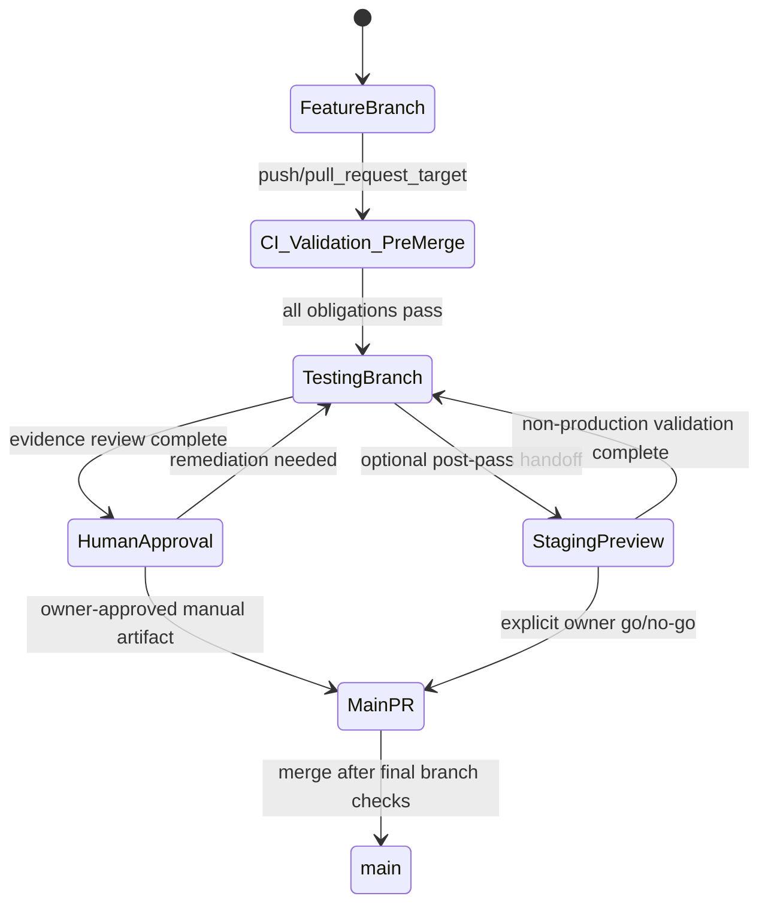

# MECE Master Plan — Public CI and Testing Branch/Automation (ISTARA-PUBLIC-CI-TESTING-20260818)

## 1. Executive summary and outcomes

Istara will adopt a **public, provider-agnostic testing branch + CI pipeline** that treats every feature change as owning its required obligations, produces a disposable QA artifact per CI run, and enforces a human approval gate before any PR may be promoted to `main`.

### Developer outcomes
- A local branch lifecycle that is identical for private and public contributors: feature branch -> public `testing` -> gated release.
- Deterministic CI checks with explicit obligations that scale with changed paths.
- Public Docker QA artifacts that any contributor can run and verify without host-specific assumptions.

### Maintainer outcomes
- Reliable coverage inference from code change to required checks.
- Explicit fail-closed behavior for uncovered features.
- Clear boundary between deterministic contract checks and bounded authorized live runtime QA.
- Enforceable human gate before PR creation/promotion to `main`.

## 2. Goals, non-goals, assumptions, constraints

### Goals
1. Define deterministic branch/lifecycle policy with branch protections and a human gate.
2. Define feature/subfeature registration and fail-closed obligation assignment for changed paths.
3. Define CI execution matrix across backend, frontend, relay, simulation, E2E, governance, security, and runtime QA.
4. Define public disposable Docker QA artifact contract (host/path/project isolation, reproducibility, retention, reset/audit).
5. Define provider-neutral contracts for chat and embeddings with exact identity, dimension checks, and one-target live authorization.
6. Preserve Research Spine semantics and keep synthetic QA provisional.
7. Define optional private staging adapters (`multivac`) without making private infra the public path.

### Non-goals
- This task does **not** implement CI/workflow code yet.
- It does **not** start Docker, run live model calls, or mutate `multivac`.
- It does **not** remove the existing `testing` branch; it sets governed behavior for its operation.

### Assumptions
- Existing CI surface remains in `.github/workflows/ci.yml` and companion workflows under `.github/workflows/*`.
- Existing runtime, relay, model, and benchmark test surfaces remain as described in current task evidence.
- Conductor handoff to implementation stage remains owner-approved.

### Constraints
- Public CI and docs must be host-independent.
- Private servers (including `multivac`) may only be staging adapters, never the official CI path.
- No model/provider calls are performed in public deterministic checks unless explicitly in authorized live lane.

## 3. Current-state evidence and gaps

### Evidence collected
- `.github/workflows` currently contains `ci.yml` plus adjacent workflows (`build-installers.yml`, `pages.yml`, `scorecard.yml`, `sync-staging.yml`, `track-autoresearch.yml`) in the worktree.
- Local branch graph includes both `testing` and `staging` and `main` branches (plus remote tracking branches).
- Workspace status indicates this project is in planning phase (`S1-plan`) and currently stale with pre-existing changes in:
  - `docs/build-stream/2026-08-17-istara-testing-docker-readiness.md`
  - `docs/features/site/manifest.json`
  - `docs/build-stream/plans/istara-testing-remote-qa-20260817-plan-b.md`.
- Candidate plans A/B/C already cover end-to-end architecture, CI mechanics, and runtime/security/spine contract details.

### Gaps to close in implementation
- Single source of truth for **coverage registry + obligation graph** is not yet codified as a merge gate.
- Explicit `multivac` distinction between public CI and optional private staging is described but not yet enforced in workflow-level policy.
- Human approval checkpoint before PR to `main` needs explicit gating artifact and ledger evidence.
- No single plan currently binds CI order, artifact publishing, and research-spine lane routing.

## 4. Target architecture and branch/CI state machine

### 4.1 Branch topology

- `main`: signed-off release branch with strict protection and no direct force merges.
- `staging`: running integrated environment for operator review, not the public approval gate.
- `testing`: long-lived integration branch for public validation.
- `feature/<owner>/<ticket>-<short-summary>`: contributor branches only.

### 4.2 State machine



### 4.3 Branch rules

- No PR to `main` is created from a feature branch directly.
- PR creation from `testing` to `main` is blocked until:
  - change-obligation registry is complete,
  - command evidence is attached,
  - owner/manual gate record is present.
- Failures in live runtime obligations stop at `testing` and require human-justified replay.

## 5. Feature/subfeature registry and change-obligation algorithm

### 5.1 Registry model (authoritative)

Create/maintain `docs/build-stream/feature-obligations.json` (or equivalent generated artifact) with entries:

```yaml
feature_id: string
evidence_domain: route|menu|store|agent|skill|model|test|runtime|security
path_patterns:
  - "backend/app/**"
  - "frontend/src/**"
  - ".github/workflows/**"
checks:
  - contract
  - deterministic_tests
  - ui_menu_registry
  - feature_reports
  - runtime_obligations
  - provider_identity
owner: team-or-role
last_updated: timestamp
```

### 5.2 Classification algorithm

1. Detect changed paths for each PR.
2. Match patterns against the registry table.
3. Derive required obligations:
   - `contract` (backend contract tests + schema checks)
   - `frontend` (unit/type/lint/build)
   - `llm_contract` (model/provider contract tests)
   - `research_spine` (provisional acceptance states and synthetic evidence handling)
   - `runtime_smoke` (bounded runtime simulation/relay checks)
   - `runtime_live_authorized` (single-provider, owner-approved smoke, no fallback)
4. Require an explicit route for each changed path class.
5. **Fail-closed**: if a changed path has no mapped obligation, fail with `PENDING_OBLIGATION_MAPPING` and block merge.

### 5.3 UI/menu/route/store/agent/skill/model/test updates

Any change to these planes must trigger:

- feature catalog update,
- living docs update (`docs/features/*` surfaces touched by the change),
- route/tests/contract mapping update,
- and obligation artifact update committed in same PR.

When a feature plane changes without a registry entry, CI fails and opens an owner action.

### 5.4 Registry ownership

- Registry authoring: `build` lane owner.
- Registry enforcement in CI: reviewer lane + implementer lane cross-check.
- Registry drift: blocked by `scripts/check_change_obligations.py`.

## 6. Automated test pyramid and execution matrix

Execution is deterministic where possible and explicit by obligation.

1. **Static/code-quality preflight**
   - changed-path classification
   - lint/format/type checks
   - contract-file integrity checks (docs/features linkage, API contract coverage)

2. **Backend deterministic layer**
   - targeted unit and property tests
   - backend contract and mutation checks
   - security baseline tests for changed modules

3. **Frontend layer**
   - unit tests, type checks, lint, and build
   - affected feature/component route smoke checks

4. **Relay/proxy layer**
   - relay startup/liveness
   - protocol and proxy contract checks

5. **Simulation layer**
   - scenario suites that model changed behavior

6. **E2E/runtime integration layer**
   - only for API/UI path classes that require it

7. **Security and governance layer**
   - security benchmark pass/fail and policy gate
   - route/type drift, governance diff checks

8. **Runtime artifact layer**
   - build QA image
   - run disposable environment (compose profile)
   - reset/seed/audit and smoke checks

9. **Authorized live provider layer**
   - only when explicitly required by obligations and configuration,
   - single provider target and no fallback,
   - explicit output evidence of model and embedding identity.

### Matrix by route class (example)

| Change class | Must run | Must record | Hard gate |
|---|---|---|---|
| backend route only | backend unit + contracts | contract report + changed-path obligations | pass |
| frontend route/menu | frontend unit + type + build | feature doc parity report | pass |
| skill/agent | backend unit + runtime simulation + scenario + governance checks | skill traceability report | pass |
| model provider config | provider contract tests + security benchmark + live-sanity (authorized) | provider identity manifest | pass |
| vector/embedding path | embedding dimension + `assert_vector_space_invariant` | invariant report | pass |
| staging infra file | runtime + container config + staging integration scenario | container diff report | pass |

## 7. Docker artifact/runtime, seed/reset, provider, staging contracts

### 7.1 Public QA artifact contract

- Output type: ephemeral compose project + image + artifact bundle.
- Image tag format: `ghcr.io/istaralabs/istara-ci-qa:${sha}-${run_id}`.
- Artifact contains:
  - run manifest
  - command/event log bundle
  - obligations outcome matrix
  - reset + seed report
  - provider identity report (if live lane executed)

### 7.2 Build/reproducibility rules

- Container image build must be from repository-locked lockfiles and pinned toolchain manifests.
- `docker build` and compose config must include non-secret config only.
- CI should refuse unresolved mutable references in base images unless explicitly approved by owner and version-pinned.

### 7.3 Runtime isolation and reset model

For each CI run:
- Generate unique run-scoped Compose project name and volume names.
- Start from empty/isolated volumes.
- Seed with public synthetic corpus slice + synthetic provenance.
- Run reset checkpoint before each major suite.
- On completion, collect logs + test artifacts and remove volumes in cleanup.

### 7.4 Logging and retention

- Retain artifacts for short period (e.g., 14–30 days) for reruns and evidence review.
- Store per-run `run-id` logs and `obligation matrix` in object storage or repository-artifact equivalent.
- Never persist secrets in artifact logs.

### 7.5 Resource/network boundaries

- Explicit CPU/memory limits, no privileged mode,
- restricted bind mounts,
- explicit port exposure for QA and no host networking,
- HTTPS origin list for UI/API interactions.

## 8. Provider neutrality and runtime safety

### 8.1 Adapter contracts

For each provider declaration:
- provider_id, model_id, family, context limit, embedding dimension, endpoint provenance tag,
- readiness checks, supported features,
- exact expected outputs for deterministic probes.

### 8.2 Fail-closed provider behavior

- A missing or mismatched provider identity report fails obligations.
- `vector_dimension` and `assert_vector_space_invariant` must be checked before any embedding-based contract is approved.
- No fallback to a different model/provider in lane that claims contract adherence.

### 8.3 Authenticated live lane

- Exactly one live provider target per run per changed feature set.
- Live lanes are **authorized** via explicit reviewer input (not automatic).
- If a live lane fails, system remains in provisional state; do not promote to `main`.

## 9. Research Spine and self-improvement governance

### 9.1 Invariant mapping

- Synthetic corpus and generated QA outputs are mapped to `provisional` states.
- Synthetic sources are evidence for lane execution, not final facts.
- Accepted reports/tasks require explicit human approval after evidence bundle review.

### 9.2 Independent coder / reliability / reconciliation gates

- Every high-risk lane must include at least:
  - independent coder verification of claim parsing,
  - reliability scoring,
  - reconciliation evidence before human gating.

### 9.3 Scope preservation

- Keep repository scope and project scope explicit in evidence payloads.
- Preserve route evidence and governance state in command artifacts.
- Never infer public approvals from provider-side metrics alone.

## 10. Security and privacy controls

- No credentials or tokens in repo, logs, or CI output.
- Secrets consumed from environment at runtime only.
- Artifact collection redacts PII and provider tokens.
- Enforce WebAuthn/WS/CORS boundaries and screenshot data retention policy in runtime runs.
- Keep Docker socket unexposed except build/runtime minimum privileges.
- Run security benchmark gate where scope changes touch auth/model/provider/security-sensitive files.
- Keep SBOM or provenance outputs attached when image build is touched.

## 11. Human gate and PR promotion flow

1. CI completes all obligations for changed paths.
2. Human reviewer confirms:
   - changed-path registry coverage,
   - evidence artifacts completeness,
   - posture and security gate status,
   - unresolved risks.
3. A manual approval artifact is created (`handoff` + `human_approval` file or equivalent).
4. Only with explicit approval can PR be opened from `testing` to `main`.
5. PR to `main` is blocked by additional branch-protection check for this manual approval marker.

## 12. Optional `multivac` adapter and rollback

### 12.1 Separation principle

- `multivac` is optional, owner-local, and staging-only.
- Public CI/branch policy cannot rely on private host URLs or private endpoints.

### 12.2 Adapter contract

- Read-only inventory first, then optional staging profile.
- New dedicated project name and isolated namespace.
- Loopback/tunnel or HTTPS mode only with explicit allowlist.
- Firewall/listener evidence and rollback plan required before accepting any host adapter change.

### 12.3 Rollback conditions

- Remove host-specific settings,
- revert staging wiring,
- restore public policy if public checks pass without `multivac` path.

## 13. Implementation phases (target)

### Phase 0 — Foundation
- Implement obligations registry schema and check scripts.
- Add branch/obligation policy docs.
- Add baseline dry-run verification.

### Phase 1 — CI orchestration wiring
- Integrate change-obligation gate.
- Add deterministic ordered jobs and fail-closed behavior.

### Phase 2 — Artifact and runtime platform
- Add QA compose profile and deterministic runbook.
- Add seed/reset/audit pipeline outputs.

### Phase 3 — Provider and Spine lanes
- Add live-provider authorization checks,
- add invariant checks,
- enforce provisional synthetic lane gating.

### Phase 4 — Human gate and rollout
- Add manual approval checkpoint before PR creation to `main`,
- enforce reviewer evidence bundle,
- complete architecture docs and acceptance updates.

## 14. Acceptance criteria (Given / When / Then)

- **Given** a feature touches route and skill files, **when** CI runs, **then** route obligations and skill-contract obligations both execute and `PENDING_OBLIGATION_MAPPING` does not remain.
- **Given** only documentation changes, **when** CI runs, **then** it should execute only required doc/parity checks and still enforce registry linkage.
- **Given** a provider path change, **when** live-provider lane is required, **then** exact provider identity, model id, and dimension evidence is attached and no fallback occurred.
- **Given** synthetic corpus-only checks pass, **when** PR is proposed, **then** it remains provisional and cannot auto-promote to an accepted report without manual gate.
- **Given** any obligation failure or security gate failure, **when** summary is emitted, **then** the run is marked failed and human remediation is required.
- **Given** all deterministic gates pass and human approval exists, **when** PR is created from `testing` to `main`, **then** branch protection allows merge with the approval record attached.

## 15. Exact verification commands and evidence artifacts

### Commands to verify (implementation phase)

1. `python scripts/check_change_obligations.py --verify`
2. `python scripts/check_ci_governance.py`
3. `python scripts/check_public_tree_clean.py`
4. `python scripts/security_benchmark.py --fail-on-threshold` when in-scope.
5. `python scripts/public_repo_quality_audit.py --check` (post implementation).
6. `docker compose -f docker-compose.qa.yml config --quiet`
7. `compass-forge task evidence <task> --type command ...` for every mandatory command run.

### Evidence to persist for each CI run
- obligation matrix output,
- test result JSON,
- container artifact manifest,
- reset/audit report,
- security benchmark result,
- human approval marker.

## 16. Alternatives, failure modes, architecture debt, and rollback

### Alternatives assessed
1. **Do-nothing extension**: predictable debt and non-deterministic coverage.
2. **Benchmark-only overlay**: weak coverage of non-benchmark paths.
3. **Private-host-first workflow**: violates provider-agnostic contract.
4. **Unscoped self-hosted runner model**: inconsistent external reproducibility.

### Key failure modes
- Missing registry entry for new feature path.
- Drift between obligations and implemented tests.
- Provider identity drift and vector-space mismatch.
- Artifact retention/capacity failures in reusable public runs.

### Architecture debt and migration order
- Debt: registry/obligation schema adoption may initially fail for broad legacy paths and require staged migration.
- Migration: run in two passes—seed registry map for backend/frontend/core paths first, then skill/agent/provider/staging edges.

### Rollback strategy
- Keep changes scoped per phase.
- Preserve branch switch capability to previous workflow config.
- Remove `multivac` dependency first if public checks regress.

## 17. Files/surfaces likely to change during implementation

- `.github/workflows/ci.yml` and any workflow extension files.
- `docs/build-stream/2026-08-18-istara-public-ci-testing-automation.md` (status/ledger updates).
- `scripts/check_change_obligations.py` (or new equivalent), `scripts/check_ci_governance.py`.
- `scripts/public_repo_quality_audit.py` or new governance utility.
- `docker-compose.qa.yml` and supporting QA compose overrides.
- `backend` and `frontend` CI-adjacent config if needed (for deterministic matrix triggers).
- `docs/architecture/agentic_core.md` and architecture contract docs.
- `Tech.md`, `CHANGE_CHECKLIST.md`, `backend/istara_backend.egg-info/SOURCES.txt` as architecture/docs descriptors.

## 18. Open decisions that remain owner-gated

- Final policy for how many artifact-days to retain and where to store them.
- Whether provider-lane live checks run nightly, on-demand, or pre-merge for all provider-impacting changes.
- Whether public `testing` branch accepts force-pushes under a release lock.
- Scope of legacy CI cleanup that can be merged with this system in the first implementation wave.

## 19. Decision synthesis matrix (A/B/C integration)

| Domain | Source lane strengths used | Master resolution |
|---|---|---|
| Branch lifecycle and governance | Architect A + B | Adopt A-wide public topology and A/B failure/handoff pattern |
| Obligation engine | B + C | Use B registry + C runtime guardrails and provenance |
| Runtime/container artifact | B + C | Use C disposable profile + B explicit execution ordering |
| Provider safety | C + B | Enforce C invariant-heavy lane policy + B deterministic-first ordering |
| Research Spine/provisional states | C | Keep provisional-only lane semantics as mandatory |
| Human-gated PR policy | A | Keep explicit manual gate before promotion |
