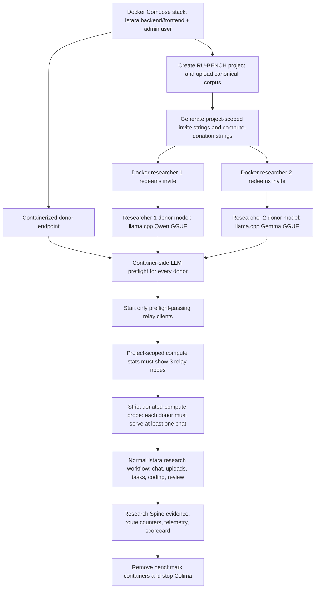

# Istara Real User UX Research Benchmark

This benchmark is a durable, repeatable long-form rehearsal of Istara as used by a realistic research team. It is intentionally heavier than the normal simulation suite: it installs or targets sandboxed Istara services, materializes the canonical synthetic research corpus, drives the actual UI where possible, exercises API-backed workflows, reviews tasks like human researchers, records every action, and emits comparison-ready scorecards.

Plan mode is credential-free. Probe and full comparison runs require donated compute and non-empty live chat by default, using the same configured `google/gemma-4-e4b` live-test profile as Istara's LLM eval contract. Offline harness debugging can opt out with explicit environment variables, but those runs should not be treated as product-quality comparisons.

Every run loads the benchmark conductor system prompt from `tests/real_user_benchmark/system-prompt.md`, records its version and SHA-256 in `run-metadata.json`, copies the prompt into the run folder as `system-prompt.md`, and logs `system_prompt.loaded` in `action-log.jsonl`. This makes the simulation policy auditable across reruns.

The benchmark is intentionally a longitudinal real-user layer, not a replacement for Istara's classical deterministic studies. It references `tests/simulation`, `tests/evals`, `tests/benchmarks`, and `scripts/security_benchmark.py` through `benchmark-registry.json`; it should not re-run or re-implement those suites inside the long-form user session.

## Quick Start

Run a static plan plus corpus generation without touching a live app:

```bash
npm --prefix tests/real_user_benchmark run plan
```

Run a short probe against an already running local Istara:

```bash
ISTARA_API_URL=http://localhost:8000 \
ISTARA_FRONTEND_URL=http://localhost:3000 \
ISTARA_E2E_ALLOW_LOCAL_TOKEN=1 \
npm --prefix tests/real_user_benchmark run probe
```

This probe now expects a donated compute node and live chat output. For harness-only debugging against an app with no model connected, add `ISTARA_BENCHMARK_REQUIRE_COMPUTE_DONATION=0 ISTARA_BENCHMARK_REQUIRE_LIVE_CHAT=0`.

### Acceptance profiles

Live acceptance is explicit about which evidence plane is under test. The
default `ISTARA_BENCHMARK_ACCEPTANCE_PROFILE=combined` selects both gates and
only passes when the provider-plane Research Spine validation and Petals
donation interoperability evidence are present in the same run. Use
`ISTARA_BENCHMARK_ACCEPTANCE_PROFILE=provider` for a provider-only retake
(three independent model coders, Fleiss' kappa with the configured companion
reliability metric, source grounding, reconciliation, and promotion evidence),
or `ISTARA_BENCHMARK_ACCEPTANCE_PROFILE=petals` for a donation-only retake
(containerized relay registration, distinct donor routes, and served donated
requests). A scorecard records each gate as `verified`, `blocked`, `not_run`,
or `not_selected`; a passing Petals gate is never reported as Research Spine
validity. Explicit `ISTARA_BENCHMARK_RUN_CODING_VALIDATION` and
`ISTARA_BENCHMARK_REQUIRE_COMPUTE_DONATION` values can narrow a diagnostic run,
but a comparison claim should use the selected profile's defaults and the
combined profile for the final interoperability assertion.

Run a deeper bounded probe for video material and Research Spine evidence:

```bash
ISTARA_API_URL=http://localhost:8000 \
ISTARA_FRONTEND_URL=http://localhost:3000 \
ISTARA_BENCHMARK_ADMIN_USERNAME=admin \
ISTARA_BENCHMARK_ADMIN_PASSWORD=istara123 \
ISTARA_BENCHMARK_RESEARCHER_COUNT=2 \
npm --prefix tests/real_user_benchmark run probe:deep
```

`probe:deep` uploads the full 174-source canonical corpus, runs 20 detailed researcher chat turns, creates/reviews 16 detailed research tasks, executes a bounded coding-validation pass, captures Research Spine summary/traceability/telemetry evidence, and probes ReasoningBank, Memento skill health, improvement governance, Meta-Hyperagent, and Autoresearch surfaces without applying live self-evolution mutations by default. The canonical corpus now carries more than 2.5 million words/row-word equivalents, and the benchmark project context, chat turns, and task prompts are deliberately long-form so the run tests realistic senior-researcher complexity rather than one-line demo prompts. Set `ISTARA_BENCHMARK_START_AUTORESEARCH_EXPERIMENT=1` only when you explicitly want a bounded one-iteration Autoresearch background experiment.

Run the full benchmark with sandbox orchestration enabled:

```bash
ISTARA_BENCHMARK_ADMIN_USERNAME=admin \
ISTARA_BENCHMARK_ADMIN_PASSWORD='IstaraBenchmarkAdmin123!' \
npm --prefix tests/real_user_benchmark run full
```

The full run can start a fresh Team Mode server sandbox with an admin bootstrap user. All live benchmark services, browser clients, relay clients, and model servers must run in Docker/Compose; the Mac Studio is only the Docker host and SSH control plane. The historical host-managed three-model topology is now refused before any live service or package operation. A fully containerized three-donor runner remains a separate acceptance gate and must provision the Istara stack plus all three donor endpoints inside Docker before it can claim ensemble evidence. When compute donation is required, the server must have a network access token before generating compute donation strings; sandbox runs provide one up front, and current Istara servers auto-provision one during admin compute-donation generation when missing. The benchmark then starts relay client containers using the same live LLM profile contract as `tests/llm_test_config.py`, waits for project-scoped `/api/compute/stats?project_id=...` to show every required relay node, and requires each required donor to serve a strict donated-compute technical probe before treating chat as useful evidence.

Admin-only setup remains admin-owned. Normal research work is performed by authenticated researcher actors: collaborative chat, document/interview analysis, task creation, review/revision, approval, and task-backed Findings/report generation. If a researcher path is blocked by permissions, the run records a role/product finding instead of silently substituting the admin session.

Researcher approval is intentionally strict. A task output that says it is blocked, missing required source material, low confidence because data is unavailable, or synthetic for a source-backed task is sent back for revision instead of being counted as done.

Test data cleanup is explicit, not automatic. The benchmark creates a new `[RU-BENCH] ... <run-id>` project for each run. Use `scripts/reset_test_environment.py` before a clean video or comparison run when you want zero existing projects, seeded `admin` / `istara123`, and on-demand `researcher_N` accounts. Normal probe/full runs do not delete old projects.

Server and client sandboxes are separate inside the Docker workflow. `--start-sandbox` starts Istara in a container; donor/researcher containers are controlled by `ISTARA_BENCHMARK_START_CLIENT_SANDBOXES` and default on whenever donated compute or external connection strings are required. Do not run the orchestrator on the Mac Studio host or point it at a host-managed Istara instance. The legacy `probe:deep:three-model` command intentionally exits with a Docker-only policy blocker; use `scripts/runner/docker-run.sh` for the supported containerized engine comparison, and treat three-donor Research Spine acceptance as open until a containerized donor topology is provisioned.

The supported wrapper builds a disposable `scripts/runner/Dockerfile` image (Node 20 plus the
Linux Docker CLI) and mounts the Docker API socket only into that short-lived runner when
client sandboxes are enabled. This is required because donor model and relay containers are
created by `run.mjs` from inside the runner. Application Compose services never receive the
socket. If the socket or the runner's Docker CLI is unavailable, the wrapper exits before
starting an engine arm; it never falls back to host execution. Set `ISTARA_RUNNER_IMAGE` only
to an image that contains Node, the benchmark dependencies' base tooling, and a Linux Docker
CLI. The wrapper defaults `ISTARA_BENCHMARK_REQUIRE_COMPUTE_DONATION` to `1` and forwards all
`ISTARA_BENCHMARK_*` topology/profile/connection inputs through a mode-600 transient env file.
Values named by donor `*_API_KEY_ENV` must be listed in
`ISTARA_BENCHMARK_PASSTHROUGH_ENV_NAMES` (comma-separated) so they enter the runner without
appearing in the Docker command line. Set the requirement to `0` only for an explicit offline
harness control; such a run is not Research Spine or engine-comparison evidence.

### Three-Model Benchmark Flow



The donated relay defaults to the shared live-test profile:

- Base URL: `ISTARA_LIVE_LLM_BASE_URL`, then `ISTARA_PRIMARY_LLM_TEST_BASE_URL`, then `LMSTUDIO_HOST`, loaded from process env or gitignored `.env`, `.env.local`, `backend/.env`, and `backend/.env.local`.
- Model: `google/gemma-4-e4b`, matching `PRIMARY_TEST_MODEL` in `tests/llm_test_config.py`.
- Secret: `ISTARA_LIVE_LLM_API_KEY`, `ISTARA_LLM_TEST_API_KEY`, `ISTARA_PRIMARY_LLM_TEST_API_KEY`, `LMSTUDIO_API_KEY`, or the macOS Keychain service `istara-live-openai-compatible-tests`.
- Container addressing: if the configured host is `localhost`, `127.0.0.1`, or `::1`, the relay container receives `host.docker.internal`; Linux runs also add a Docker host-gateway mapping. For LM Studio hosts ending in `/v1`, the benchmark strips that path for LM Studio native model/load endpoints while still using `/v1/chat/completions` for chat.

Private endpoint values and tokens are never written to logs; run artifacts record only source names, booleans, redacted model/host metadata, and whether localhost translation or LM Studio path normalization occurred.

## Multi-Donor Compute Mode

Use multi-donor mode when you want one Istara orchestrator to receive compute from two or more simulated workstations. Each donor container runs Istara Relay and points at its own already provisioned LM Studio/OpenAI-compatible endpoint. The benchmark does not install LM Studio or download models inside the relay image; LM Studio is a desktop/runtime dependency that must already be running, or be replaced by a compatible test endpoint you provide.

### Per-Donor Model Server Sandboxes

For Colima/Docker runs that need each simulated donor to own a different model endpoint, the benchmark can now start an opt-in model server container for each donor before it starts the relay client. This is intentionally separate from the relay container: the model server owns inference, and the relay container donates that endpoint back to Istara.

Supported local model server modes:

- `ISTARA_BENCHMARK_DONOR_<N>_MODEL_SERVER=llamacpp`: starts `ghcr.io/ggml-org/llama.cpp:server` against a local `.gguf` file.
- `ISTARA_BENCHMARK_DONOR_<N>_MODEL_SERVER=ollama`: starts `ollama/ollama:latest` with a bind-mounted Ollama model directory.

The model sandbox never downloads models by default. Put Q4/4-bit GGUFs or Ollama model stores under `$HOME/Istara-Projects/models`, or set `ISTARA_BENCHMARK_MODEL_ROOT` to another local model root. Q4 evidence is required by default through the model filename, configured model id, or `ISTARA_BENCHMARK_DONOR_<N>_QUANTIZATION`; disable that only for a deliberate negative/control run with `ISTARA_BENCHMARK_DONOR_<N>_REQUIRE_Q4=0`.

Example: main Istara server on the Mac Studio, donor 1 using the host LM Studio, and donor 2 using a Colima-hosted llama.cpp Q4 model endpoint:

```bash
ISTARA_BENCHMARK_SKIP_SANDBOX=1 \
ISTARA_BENCHMARK_START_CLIENT_SANDBOXES=1 \
ISTARA_BENCHMARK_DONOR_COUNT=2 \
ISTARA_BENCHMARK_REQUIRE_DISTINCT_DONOR_ENDPOINTS=1 \
ISTARA_BENCHMARK_COLIMA_MAX_ACTUAL_GB=25 \
ISTARA_BENCHMARK_COLIMA_MAX_APPARENT_GB=25 \
ISTARA_BENCHMARK_COLIMA_STORAGE_POLICY=fail \
ISTARA_BENCHMARK_DONOR_1_LLM_PROVIDER=lmstudio \
ISTARA_BENCHMARK_DONOR_1_LLM_HOST=http://localhost:1234 \
ISTARA_BENCHMARK_DONOR_1_LLM_MODEL=google/gemma-4-e4b \
ISTARA_BENCHMARK_DONOR_1_LLM_API_KEY_ENV=LMSTUDIO_API_KEY \
ISTARA_BENCHMARK_DONOR_2_MODEL_SERVER=llamacpp \
ISTARA_BENCHMARK_DONOR_2_MODEL_SERVER_PORT=18112 \
ISTARA_BENCHMARK_DONOR_2_MODEL_FILE=$HOME/Istara-Projects/models/qwen3.5-4b-q4_k_m.gguf \
ISTARA_BENCHMARK_DONOR_2_LLM_MODEL=qwen3.5-4b-q4_k_m \
npm --prefix tests/real_user_benchmark run probe
```

The former host-managed example is intentionally unavailable. The supported target is a fully containerized topology: Docker Compose runs Istara and the admin flow, while disposable Docker containers run each simulated researcher and each Qwen3.5 4B Q4 or Gemma 4 E2B Q4 llama.cpp endpoint. Until that topology is wired into the remote runner, the command below is expected to fail closed with a Docker-only policy blocker rather than touch the Mac Studio host:

```bash
npm --prefix tests/real_user_benchmark run probe:deep:three-model
```

The `probe:deep:three-model` script still describes the donor identities for fixture compatibility, but it is a refusal/diagnostic path until the Docker-only runner owns all services. A future containerized implementation must provide:

- donor 1: a Compose-managed OpenAI-compatible Gemma donor
- donor 2: `istara-donor-qwen35-4b` via llama.cpp on port `18112`, context length `12288`
- donor 3: `istara-donor-gemma4-e2b` via llama.cpp on port `18113`, context length `12288`

The expected local Q4 files default to `$HOME/Istara-Projects/models/qwen3.5-4b-q4_k_m/Qwen3.5-4B-Q4_K_M.gguf` and `$HOME/Istara-Projects/models/gemma-4-e2b-it-q4_k_m/gemma-4-E2B-it-Q4_K_M.gguf`. Override them with `ISTARA_BENCHMARK_QWEN_GGUF` and `ISTARA_BENCHMARK_GEMMA_E2B_GGUF` when the files live elsewhere. The benchmark still refuses to download or invent models.

The preset matches the existing local llama.cpp donor-container contract and treats missing GGUF files or unreachable endpoints as setup blockers. By default it removes relay/model containers and stops Colima after benchmark-owned resources are cleaned up, returning the host LM Studio donor to ordinary idle service. For debugging only, set `ISTARA_BENCHMARK_KEEP_DONOR_MODEL_CONTAINERS=1`, `ISTARA_BENCHMARK_KEEP_CLIENT_CONTAINERS=1`, or `ISTARA_BENCHMARK_STOP_COLIMA_AFTER_RUN=0`.

For Gemma or Qwen model-server donors, use the exact model id expected by the provider. The benchmark records `donor-endpoint-diversity.json`, `donor-model-sandbox-<donor>.json`, and `relay-llm-preflight-<donor>.json` so a run can prove that multiple donations came from multiple endpoints rather than one shared LM Studio instance.

Helpful model sandbox controls:

- `ISTARA_BENCHMARK_DONOR_<N>_MODEL_SERVER_PORT`: host port exposed only on `127.0.0.1`; relay containers reach it through `host.docker.internal`.
- `ISTARA_BENCHMARK_DONOR_<N>_MODEL_FILE`: required for llama.cpp donors.
- `ISTARA_BENCHMARK_DONOR_<N>_MODEL_DIR`: required for Ollama donors unless the default model root is the intended model store.
- `ISTARA_BENCHMARK_DONOR_<N>_CPUS` and `ISTARA_BENCHMARK_DONOR_<N>_MEMORY`: Docker limits for that donor model server.
- `ISTARA_BENCHMARK_DONOR_<N>_ALLOW_PULL=1`: allows an Ollama donor to pull a missing model. Keep this off for storage-bounded Colima runs.
- `ISTARA_BENCHMARK_KEEP_DONOR_MODEL_CONTAINERS=1`: keeps model server containers running after the benchmark for manual inspection.

Default donor profile 1 is the configured live-test Gemma target:

- Donor id: `donor-1-gemma4`
- Model family: Gemma
- Model contract: `google/gemma-4-e4b`

Default donor profile 2 and above are Qwen placeholders:

- Donor id: `donor-2-qwen35-4b`
- Model family: Qwen
- Model contract: `Qwen3.5-4B`
- Provisioning: disabled until you supply an endpoint; the benchmark records a product/environment blocker instead of downloading or auto-loading a missing model.

Example with two donated endpoints and an Istara server running outside Docker:

```bash
ISTARA_BENCHMARK_SKIP_SANDBOX=1 \
ISTARA_BENCHMARK_START_CLIENT_SANDBOXES=1 \
ISTARA_BENCHMARK_DONOR_COUNT=2 \
ISTARA_BENCHMARK_DONOR_1_LLM_PROVIDER=lmstudio \
ISTARA_BENCHMARK_DONOR_1_LLM_HOST=http://localhost:1234 \
ISTARA_BENCHMARK_DONOR_1_LLM_MODEL=google/gemma-4-e4b \
ISTARA_BENCHMARK_DONOR_1_LLM_API_KEY_ENV=LMSTUDIO_API_KEY \
ISTARA_BENCHMARK_DONOR_2_LLM_PROVIDER=lmstudio \
ISTARA_BENCHMARK_DONOR_2_LLM_HOST=http://localhost:2234 \
ISTARA_BENCHMARK_DONOR_2_LLM_MODEL=Qwen3.5-4B \
ISTARA_BENCHMARK_DONOR_2_LLM_API_KEY_ENV=QWEN_LMSTUDIO_API_KEY \
ISTARA_BENCHMARK_COMPUTE_CONNECTION_STRINGS="$GEMMA_COMPUTE_STRING,$QWEN_COMPUTE_STRING" \
ISTARA_BENCHMARK_USER_INVITE_CONNECTION_STRINGS="$RESEARCHER_INVITE_STRING" \
npm --prefix tests/real_user_benchmark run probe
```

If you want the benchmark to ask interactively, run from a real terminal:

```bash
ISTARA_BENCHMARK_SKIP_SANDBOX=1 \
ISTARA_BENCHMARK_EXTERNAL_CONNECTION_STRINGS=1 \
ISTARA_BENCHMARK_INTERACTIVE_CONNECTION_STRINGS=1 \
npm --prefix tests/real_user_benchmark run probe
```

The prompt asks how many compute donor containers and researcher invite containers to start, then accepts per-donor compute donation strings and researcher invite strings. Empty answers mean “generate through the Istara API if the admin session can do so.”

Compute donation strings are signed and validated by the Istara server, so the benchmark must not rewrite `localhost` inside their payload. When it generates strings for Docker client sandboxes, it signs Docker-reachable `host.docker.internal` URLs up front. Externally supplied compute donation strings must already contain a server and relay URL reachable from the donor container; otherwise the benchmark records a connection-string blocker instead of mutating the signed payload.

For noninteractive CI or repeated local runs, use a gitignored JSON file:

```json
{
  "compute_donations": ["rcl_...", "rcl_..."],
  "user_invites": ["rcl_..."]
}
```

Then run:

```bash
ISTARA_BENCHMARK_CONNECTION_STRINGS_FILE=.istara-benchmark-connections.local.json \
ISTARA_BENCHMARK_DONOR_COUNT=2 \
npm --prefix tests/real_user_benchmark run probe
```

When multiple required donors are configured, the benchmark waits for project-scoped `/api/compute/stats?project_id=...` to expose every required relay/browser node. The intended three-model Docker preset expects three observable relays: one Compose-managed Gemma donor plus two Docker researcher donors. The run records `compute-donation-results.json`, per-donor `relay-llm-preflight-<donor>.json`, connection-string materialization evidence, route evidence, and whether multi-donor compute was actually verified. If any required donor fails preflight, registration, or serving, the run is not silently accepted as a multi-donor success. During the collaborative research workflow, the benchmark also records `natural-compute-orchestration.json`, which observes Istara's normal model manager and scheduler counters after real chat/task/report work without pinning a particular donor. Observing scheduler counters is not the same as proving donor usage; the scorecard keeps those concepts separate.

For the three-model preset, Research Spine coding must also prove multi-model validation across the actual Docker donor topology. Immediately before coding, the benchmark must wait for all three containerized donor relays to be healthy and record `research-spine-pre-coding-relay-health.json`. A run that reaches `/api/research-validity/.../coding-runs` but falls back to a one-coder lower-assurance result, or uses three model aliases from fewer than three served donor routes, is a benchmark blocker. `research-spine-evidence.json` should show three distinct model coders and three distinct served donor route IDs for the full topology; if a donor cannot produce valid source-unit code applications, the run records the reason and fails closed.

The benchmark also records `research-spine-evidence.json` and `self-improvement-evidence.json`. Those artifacts distinguish raw source/evidence-unit/coding/reconciliation/report-gate evidence from process-learning evidence. Telemetry, ReasoningBank, Memento Skills, Meta-Hyperagent, Autoresearch, RAG/GraphRAG, Prompt-RAG, and compression evidence are benchmarked as governance/process inputs; they are not treated as report evidence unless resulting artifacts pass the Research Spine.

When the Mac Studio host also donates the same LM Studio endpoint that the server already sees as local capacity, the bounded technical probe temporarily enables strict project/model routing so the project-scoped relay is preferred over the duplicate server-local node. This is only for route-proof evidence. The later collaborative chat and task workflow returns to Istara's normal scheduler and records natural selected/served/failure counter deltas separately. A configured host LM Studio default is not allowed to become an implicit strict project request during that natural workflow; only an explicit model override may pin donor selection.

If Docker or the app blocks completion, the run is still useful: the blocker, logs, screenshots, and partial results are preserved. The harness treats first failures as prompts for architecture-aware diagnosis: it checks whether the benchmark misunderstood Istara state, auth, onboarding, or render timing before logging a product finding.

The remote Mac Studio must already have an approved Docker daemon and Compose plugin. The benchmark does not install host packages, invoke Homebrew, manage Colima, or start a host-managed Istara process. Storage and VM lifecycle are operator-owned prerequisites; record their state as passive evidence before a run. A small smoke run can use 6GB, but a future two-llama.cpp three-model Docker topology should reserve at least 12GB to avoid OOM-killing one donor while the other is serving.

## Modes

- `plan-only`: creates the run folder, corpus, playbook snapshot, feature matrix, and scorecard scaffold.
- `probe`: targets existing services and runs a bounded subset of onboarding, integration, chat, upload, and review flows.
- `full`: targets or starts sandboxed services and aims for 100 chat turns plus 50 human-approved tasks.

## Real-User Workflow Evidence

The benchmark writes dedicated evidence files for the team workflow:

- `researcher-actors.json`: authenticated researcher accounts and personas.
- `collaborative-chat-contributions.json`: which researchers contributed chat turns.
- `collaborative-task-workflow.json`: task creators, reviewers, revision requests, approvals, and actor contributions.
- `interview-process-evidence.json`: transcript sources plus approved `analyze-interview` task evidence.
- `natural-compute-orchestration.json`: project-scoped selected/served compute counter deltas after real research work.

Credentialed integrations such as live Figma, Google Stitch, Telegram, and AURA participant channels are optional unless bounded test tokens are explicitly supplied. The harness still exercises local/mock or setup-error paths where available and records missing credential-free participant simulation as future improvement.

## Important Environment Variables

- `ISTARA_API_URL`: backend URL, default `http://localhost:8000`.
- `ISTARA_FRONTEND_URL`: frontend URL, default `http://localhost:3000`.
- `ISTARA_E2E_ALLOW_LOCAL_TOKEN=1`: allows the benchmark to mint a local signed token from backend code for test-only auth. When this fallback is enabled, a stale `ADMIN_PASSWORD` from a local env file is logged as setup evidence instead of an actionable product issue.
- `ISTARA_BENCHMARK_LLM_PROFILE`: descriptive name for a non-donated fallback profile used during full runs.
- `ISTARA_BENCHMARK_LLM_MODEL`: fallback Ollama model for non-donated sandbox paths. Donated compute uses the shared live LLM contract above unless `ISTARA_BENCHMARK_RELAY_LLM_MODEL` is explicitly set.
- `ISTARA_BENCHMARK_RESULTS_DIR`: override result output root.
- `ISTARA_BENCHMARK_SKIP_SANDBOX=1`: target existing app services even in full mode.
- `ISTARA_BENCHMARK_START_CLIENT_SANDBOXES`: controls disposable researcher/relay containers separately from the server sandbox. Defaults to on for donated-compute and external-connection runs.
- `ISTARA_BENCHMARK_EXTERNAL_CONNECTION_STRINGS=1`: consume connection strings supplied by env, JSON file, donor profile, or interactive prompt before generating new ones through the API.
- `ISTARA_BENCHMARK_INTERACTIVE_CONNECTION_STRINGS=1`: ask how many donor/researcher containers to start and prompt for strings in a TTY.
- `ISTARA_BENCHMARK_DONOR_COUNT`: number of required compute donor containers. Default `1`.
- `ISTARA_BENCHMARK_RESEARCHER_COUNT`: number of researcher invite/client containers. Default `1`; Colima/multi-user runs commonly use `2`.
- `ISTARA_BENCHMARK_CONNECTION_STRINGS_FILE`: gitignored JSON file with `compute_donations` and `user_invites` arrays.
- `ISTARA_BENCHMARK_COMPUTE_CONNECTION_STRINGS`: comma, newline, pipe, or JSON-array list of compute donation strings.
- `ISTARA_BENCHMARK_USER_INVITE_CONNECTION_STRINGS`: comma, newline, pipe, or JSON-array list of researcher invite strings.
- `ISTARA_BENCHMARK_FRESH_SANDBOX=0`: reuse existing benchmark containers and volumes. The default is `1`, which recreates the server/client sandbox state for reproducibility.
- `ISTARA_BENCHMARK_TEAM_MODE`: defaults to `true` for browser-testable sandbox auth.
- `ISTARA_BENCHMARK_ADMIN_USERNAME` and `ISTARA_BENCHMARK_ADMIN_PASSWORD`: bootstrap credentials for the sandbox admin account. A locally reset test server uses admin `admin` / `istara123`; `ISTARA_TEST_ADMIN_PASSWORD=istara123` is accepted by harnesses for that reset-only profile.
- `ISTARA_BENCHMARK_REQUIRE_COMPUTE_DONATION`: defaults to `1` for every non-plan run. Sandbox server runs use a per-run network token when no `NETWORK_ACCESS_TOKEN` or `ISTARA_BENCHMARK_NETWORK_ACCESS_TOKEN` is present; existing servers auto-provision the token when an admin generates fresh compute donation strings.
- `ISTARA_BENCHMARK_REQUIRE_LIVE_CHAT`: defaults to `1` for full runs and whenever compute donation is required. Empty assistant text or SSE chat errors fail the benchmark instead of counting the turn.
- `ISTARA_BENCHMARK_FORCE_DONATED_CHAT=1`: optional technical isolation mode. It intentionally makes the server's direct LM Studio and Ollama routes unreachable so a probe must fall through to the donated relay path. Leave it unset for the real-user architecture test, where Istara's normal compute/model manager should decide routing and the benchmark observes natural selected/served counters.
- `ISTARA_BENCHMARK_LMSTUDIO_AUTO_LOAD_ENABLED`: defaults to `true` when compute donation is required so the server can ask the relay to load the configured LM Studio model once before declaring the donated node unusable.
- `ISTARA_BENCHMARK_LMSTUDIO_AUTO_CONTEXT_RELOAD`: defaults to `true` when compute donation is required so real chat prompts can ask the donated LM Studio relay to reload the configured model with a larger context window before the routing layer opens the streaming circuit breaker.
- `ISTARA_BENCHMARK_STRICT_AUTO_ROUTING`: defaults to `false` for real-user architecture runs so Istara's compute/model manager can naturally choose across registered donated models. It switches on only with `ISTARA_BENCHMARK_FORCE_DONATED_CHAT=1` or an explicit override, which is a technical isolation probe rather than the product-faithful multi-donor benchmark.
- `ISTARA_BENCHMARK_PRUNE_DANGLING_IMAGES`: defaults to `true`; after Docker rebuilds the harness prunes dangling image layers so repeated runs do not inflate Colima/Docker disk usage. Active containers, tagged images, and volumes are not removed by this step.
- `ISTARA_BENCHMARK_INSTALL_WHISPER`: defaults to `false` for benchmark Docker builds. Voice transcription remains exercised through UI/API graceful-degradation paths, while avoiding the Torch/Whisper dependency stack in the reusable benchmark image.
- `ISTARA_BENCHMARK_RELAY_LLM_PROVIDER`, `ISTARA_BENCHMARK_RELAY_LLM_HOST`, `ISTARA_BENCHMARK_RELAY_LLM_MODEL`, `ISTARA_BENCHMARK_RELAY_LLM_API_KEY`: optional overrides for the client-side donated target. If omitted, the benchmark uses `tests/llm_test_config.py` live-profile rules without logging secret values.
- `ISTARA_BENCHMARK_DONOR_<N>_ID`, `ISTARA_BENCHMARK_DONOR_<N>_LLM_PROVIDER`, `ISTARA_BENCHMARK_DONOR_<N>_LLM_HOST`, `ISTARA_BENCHMARK_DONOR_<N>_LLM_MODEL`, `ISTARA_BENCHMARK_DONOR_<N>_LLM_API_KEY`, `ISTARA_BENCHMARK_DONOR_<N>_LLM_API_KEY_ENV`, `ISTARA_BENCHMARK_DONOR_<N>_CONNECTION_STRING`: per-donor overrides for multi-donor runs. Prefer `*_API_KEY_ENV` so secrets stay outside process logs.
- `ISTARA_BENCHMARK_CLIENT_<N>_USERNAME`, `ISTARA_BENCHMARK_CLIENT_<N>_PASSWORD`, `ISTARA_BENCHMARK_CLIENT_<N>_EMAIL`: optional deterministic researcher account values for invite-client redemption. Defaults are `researcher_1`, `researcher_2`, ... with password `istara123` and `@istara.test` email addresses.
- `ISTARA_BENCHMARK_REQUIRE_DISTINCT_DONOR_ENDPOINTS`: defaults to `1` when more than one required donor is configured. Fails multi-donor runs where required donors point at the same provider/host pair.
- `ISTARA_BENCHMARK_DONOR_<N>_MODEL_SERVER`: optional per-donor model server sandbox. Use `llamacpp` for local Q4 GGUF files or `ollama` for a bind-mounted Ollama model store.
- `ISTARA_BENCHMARK_MODEL_ROOT`: local host model root for model-server donors. Defaults to `$HOME/Istara-Projects/models`.
- `ISTARA_BENCHMARK_DONOR_<N>_MODEL_FILE`, `ISTARA_BENCHMARK_DONOR_<N>_MODEL_DIR`, `ISTARA_BENCHMARK_DONOR_<N>_MODEL_SERVER_PORT`, `ISTARA_BENCHMARK_DONOR_<N>_QUANTIZATION`: model sandbox file/directory, port, and Q4 evidence controls.
- `ISTARA_BENCHMARK_DONOR_<N>_REASONING`: llama.cpp reasoning mode. Defaults to `off` for benchmark model sandboxes so health probes and chat checks receive visible assistant content instead of spending small token budgets on hidden thinking.
- `ISTARA_BENCHMARK_DONOR_<N>_CPUS`, `ISTARA_BENCHMARK_DONOR_<N>_MEMORY`: optional Docker resource limits for an individual donor model server.
- `ISTARA_BENCHMARK_DONOR_<N>_ALLOW_PULL`: defaults to `0`. Allows an Ollama model-server donor to pull a missing model when explicitly enabled.
- `ISTARA_BENCHMARK_KEEP_DONOR_MODEL_CONTAINERS=1`: keep temporary donor model server containers after a run for inspection.
- `ISTARA_BENCHMARK_STOP_COLIMA_AFTER_RUN`: stops Colima after benchmark-owned donor/client containers are cleaned up. Defaults to `1` for `probe:deep:three-model`; set `0` only when inspecting containers manually.
- `ISTARA_BENCHMARK_DONOR_PROFILES_JSON` or `ISTARA_BENCHMARK_DONOR_PROFILES_FILE`: advanced JSON donor profile configuration. Profiles can include `id`, `provider`, `llm_host`, `model`, `api_key_env`, and `connection_string`.
- `ISTARA_BENCHMARK_PASSTHROUGH_ENV_NAMES`: comma-separated names (for example `LMSTUDIO_API_KEY,QWEN_LMSTUDIO_API_KEY`) whose values are copied into the disposable Docker runner for donor `*_API_KEY_ENV` resolution; values are never put in Docker argv.
- `ISTARA_BENCHMARK_QWEN_LLM_HOST`, `ISTARA_BENCHMARK_QWEN_LLM_MODEL`, `ISTARA_BENCHMARK_QWEN_LLM_API_KEY_ENV`: convenience configuration for the future Qwen donor profile.
- `ISTARA_BENCHMARK_NETWORK_ACCESS_TOKEN`: optional fixed network token for relay testing in benchmark-managed server sandboxes. For an already-running local server, generate fresh compute donation strings after the server has a network token so the signed strings embed the current relay credential.
- `ISTARA_BENCHMARK_AUTOSTART_COLIMA=0`: prevent automatic Colima startup.
- `ISTARA_BENCHMARK_COLIMA_CPU`, `ISTARA_BENCHMARK_COLIMA_MEMORY`, `ISTARA_BENCHMARK_COLIMA_ROOT_DISK`, `ISTARA_BENCHMARK_COLIMA_DISK`: resource settings for automatic Colima startup. Defaults are CPU `4`, memory `6`, root disk `10` GB, and data disk `10` GB; the three-model deep probe overrides memory to `12`.
- `ISTARA_BENCHMARK_COLIMA_MAX_ACTUAL_GB`, `ISTARA_BENCHMARK_COLIMA_MAX_APPARENT_GB`, `ISTARA_BENCHMARK_COLIMA_STORAGE_TOLERANCE_GB`, `ISTARA_BENCHMARK_COLIMA_STORAGE_POLICY`: storage budgets recorded in every run. Defaults are 10GB actual, 20GB apparent, 0.25GB tolerance for filesystem metadata, and `warn`. `fail` enforces actual disk usage by default; apparent sparse-disk ceilings are advisory unless `ISTARA_BENCHMARK_COLIMA_ENFORCE_APPARENT_STORAGE=1`.
- `ISTARA_BENCHMARK_KEEP_CLIENT_CONTAINERS=1`: keep temporary relay/client containers after a run for interactive debugging. By default their logs are captured and the containers are removed.

No script in this benchmark deletes, prunes, moves, or cleans `LLMs/` or `Model_Finetuning/`.

## Outputs

Every run creates a timestamped folder under `tests/real_user_benchmark/.results/runs/` with:

- `action-log.jsonl`: every benchmark action and result.
- `conversation-turns.jsonl`: chat prompts, responses, timings, and quality notes.
- `task-review-log.jsonl`: task creation, review, revision, and approval records.
- `integration-attempts.jsonl`: third-party integration attempts and classifications.
- `corpus/`: materialized canonical UX research documents from `tests/document_corpus/canonical/`. Probe and full runs default to at least 120 long-form sources, and deep probes can upload all 174 sources, so document-heavy agentic workflows are not judged from a tiny fixture set.
- `corpus-manifest.json`: document inventory and intended use.
- `screenshots/` and `traces/`: Playwright evidence.
- `report.md`: human-readable run narrative.
- `scorecard.json`: comparison-ready numeric scores.
- `history-record.json`: compact metrics for regression tracking.
- `benchmark-registry-snapshot.json`: the suite/standards alignment active for that run.
- `system-prompt.md`: the exact benchmark conductor prompt active for that run.
- `relay-llm-preflight.json` and `relay-llm-preflight-<donor>.json`: redacted evidence that each donor container could reach its configured LM Studio/OpenAI-compatible target and complete a tiny chat request.
- `compute-donation-results.json`: relay registration, relay-routed chat verification method, forced-topology evidence when logs are quiet, and response evidence.
- `research-spine-pre-coding-relay-health.json`: health snapshot proving every required donor relay was alive before the benchmark starts source-unit coding.
- `research-spine-evidence.json`: evidence-unit, coding-run, Graph/RAG traceability, donor route evidence, and research-validity telemetry audit snapshot.
- `self-improvement-evidence.json`: telemetry, ReasoningBank, Memento skill health, improvement-governance, Meta-Hyperagent, and Autoresearch probe results.
- `natural-compute-orchestration.json`: selected/served counter deltas from normal Istara scheduler usage after collaborative research work.
- `storage/colima-*.json`: actual and apparent Colima disk snapshots, storage budget status, and remediation guidance.

The backend sandbox mounts the benchmark result root at `/benchmark-results` so linked-folder flows can point at the generated corpus from inside the container. This is deliberately separate from API uploads: the benchmark tests both folder context and upload ingestion.

The result root also keeps comparison indexes:

- `.results/history.jsonl`: one compact record per completed benchmark run.
- `.results/latest-run.json`: pointer to the latest completed run, report, scorecard, and summary.

## Credential-Free Integration Policy

The benchmark first discovers developer-friendly paths in code and API behavior:

- mock endpoints
- sandbox flags
- fake provider support
- local API host overrides
- webhook simulators
- fixture sync paths
- graceful setup and validation errors

If no such path exists, that is treated as a product finding, not a benchmark failure.

Optional live credentials may be supplied by the user in their environment, but the default run never requires Google Stitch, Figma, Google Forms, SurveyMonkey, Typeform, Telegram, Slack, WhatsApp, Google Chat, or MCP credentials.

## Agentic And Industry Eval Alignment

The long-form benchmark does not replace the deterministic evaluation suites. It reads `benchmark-registry.json` on every run, snapshots it into the result folder, and records the companion suite paths in `history-record.json`.

Default researcher turns now probe:

- donated compute and live chat on `google/gemma-4-e4b`
- tool calling and skill calling observability
- RAG/source grounding, context management, and contradiction handling
- ReasoningBank, memento, and project-memory behavior
- Hyperagent or governed-improvement safe paths
- ensemble/MoA health surfaces and compute readiness

The classical scoring baselines remain in `testing/TESTING_STRATEGY.md`, `testing/AI_EVALS_STRATEGY.md`, `tests/agentic_eval_contract.json`, `tests/evals`, and `tests/benchmarks`.

## Donor Profile Policy

The default comparison profile still uses one bounded donated LM Studio target: `google/gemma-4-e4b`. Multi-donor runs are supported through either explicit per-donor endpoints or the local `macstudio-colima-qwen-gemma` topology. That topology pairs the configured Mac Studio Gemma donor with already-downloaded Qwen3.5 4B Q4 and Gemma 4 E2B Q4 llama.cpp donors under Colima. Missing endpoints or local GGUF files remain blockers; the benchmark does not download models or fake ensemble health.

## UI Harness Rules

Playwright waits for the actual rendered app state before navigation. It classifies login, onboarding, chat, shell, no-project, server-unreachable, and blank states; after real UI authentication it selects the generated project and marks the benchmark tour complete so the first-run tour does not force navigation back to Settings during menu coverage. Sidebar clicks are attempted through accessible tab/button locators first, with any fallback clearly logged in `action-log.jsonl`.
