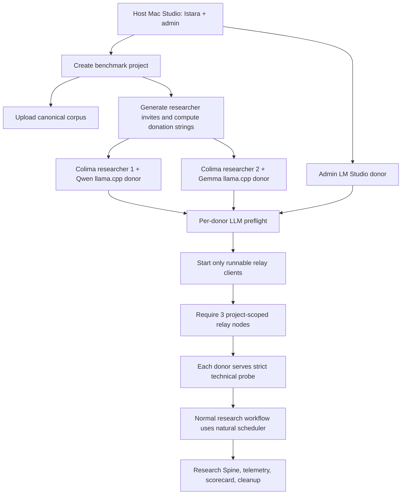

# Benchmark Plan

## Research Team Personas

Maya Rodrigues

Role: global-admin project lead and senior UX researcher at Northstar Health, working on a patient-care coordination product used by clinic staff, patients, and family caregivers.

Ana Lima

Role: researcher focused on interviews, caregiver trust, multilingual evidence, and document work.

Theo Mendes

Role: researcher focused on task review, source grounding, survey sanity checks, and findings readiness.

Behavioral model:

- Maya asks open-ended questions, then narrows into evidence checks.
- She uploads messy historical research because real teams inherit imperfect archives.
- She corrects vague summaries and asks Istara to cite sources.
- She creates work, waits for Review, reads the output, approves good work, and sends weak work back with concrete revision instructions.
- She tests third-party setup flows even when she knows credentials are unavailable.
- Ana and Theo perform the normal researcher workflow through their own authenticated sessions; Maya performs admin-only setup and governance rather than substituting for researcher work.

## Project Narrative

Project: CareNav Renewal

Problem: care coordinators lose time reconciling patient tasks across portals, SMS threads, paper notes, and phone calls. Patients and caregivers miss preparation steps before appointments, while staff cannot tell which reminders worked.

Benchmark goals:

- Validate whether Istara can ground recommendations in a large messy corpus.
- Validate whether real donated compute can serve live `google/gemma-4-e4b` chat before research-quality scoring begins.
- Measure whether reports and atomic findings make sense across mixed methods.
- Probe Istara's agentic stack through realistic researcher requests: tool calls, skill calls, RAG, context management, memento/project memory, ReasoningBank, Hyperagent/governed improvement, and ensemble/MoA health.
- Exercise the human review loop instead of assuming agent tasks are done.
- Test whether integrations fail helpfully without credentials.
- Observe natural multi-donor compute/model orchestration without forcing a donor for ordinary agentic work.
- Exercise bounded Research Spine coding validation and project-scoped self-improvement probes without applying unapproved mutations.
- Confirm approved task outputs can feed Findings/report generation.
- Exercise interview analysis through local transcript evidence, while documenting live Telegram/AURA participant channels as future work when credentials are unavailable.
- Produce reusable evidence that can be compared across product builds.
- Complement, not duplicate, the deterministic coverage already tracked in `tests/simulation`, `tests/evals`, `tests/benchmarks`, and `scripts/security_benchmark.py`.

## Operating Discipline

The benchmark is not a happy-path script. When an action fails, the harness first checks whether the failure came from benchmark misunderstanding: wrong auth mode, stale first-run tour state, frontend runtime config, missing render wait, inaccessible container path, or an unsupported integration credential profile. Only after that architecture check does it log a product issue.

For UI actions, Playwright waits until Istara has rendered a usable state before navigation or chat input. For task review, the benchmark reads the task output, records a human-quality judgment, sends weak work back with specific revision instructions, then approves only after the simulated researcher decides the output is good enough. Outputs that explicitly say they are blocked, missing required source material, low confidence because data is unavailable, or synthetic for a source-backed task are not approval candidates.

For compute, the benchmark treats donated relays as part of the product under test. Non-plan runs require the configured live model profile by default, verify relay nodes through project-scoped `/api/compute/stats?project_id=...`, and require non-empty chat output before later research tasks can count as successful. The three-model run is host-managed: the Mac Studio runs Istara, the admin user, and the LM Studio donor, while Colima runs only the two researcher/client simulations plus their Qwen/Gemma llama.cpp donor endpoints. Required donors must pass container-side LLM preflight before their relay starts. The technical route proof then enables strict project/model routing and requires every required donor relay to serve a bounded probe chat; registration, visibility, and readiness alone are not counted as usage. Technical donor proof is separate from the agentic-workflow check: collaborative chat and task execution use Istara's normal scheduler, a configured host LM Studio default remains only a preference unless a model is explicitly requested, and the benchmark compares selected/served/failure counter deltas to observe natural orchestration. The Research Spine validation check is also strict: before coding, all required donor relays must be healthy; the coding run must prove distinct multi-model coding across the expected served donor routes, not a one-coder lower-assurance fallback or three aliases from one host. The orchestration score is capped unless donor usage and multi-donor Research Spine coding are actually proven, so a run that only observes the local model scheduler does not masquerade as a successful multi-donor benchmark.

## Corpus

The benchmark materializes the canonical corpus from `tests/document_corpus/canonical/` through `tests/document_corpus/shared-corpus.mjs`.

The canonical corpus contains interview transcripts, participant profiles, diary studies, usability tests, survey/NPS/SUS/UMUX exports, card sorting, tree testing, journey maps, field notes, support tickets, analytics, A/B tests, competitor analysis, heuristic and accessibility audits, Laws of UX audits, briefs, stakeholder memos, research plans, discussion guides, consent/privacy notes, multilingual examples, malformed edge cases, and report-readiness material.

The corpus intentionally contains overlap, contradictions, missing metadata, and repeated pain points so Istara must synthesize rather than simply list. Document-heavy runs should upload at least 120 long-form canonical sources before corpus grounding receives full benchmark credit. Smaller named slices are allowed for focused checks only when the slice is manifest-backed and the test is explicit about the scope.

Research-validity focused checks should use the canonical `coding-reliability`, `graph-synthesis`, and `low-consensus-review` slices so qualitative coding, Evidence Graph traversal, and reconciliation tests cannot silently fall back to tiny ad hoc fixtures. Canonical manifest entries must use Istara upload-processable file types, so product-level runs cannot fail because the source-of-truth corpus contains unsupported archive formats.

## Feature Coverage Matrix

| Feature | Required Evidence |
| --- | --- |
| Sandboxed server install | container/log evidence or blocker |
| Connection string | generated user invite and compute donation string where available |
| Sandboxed client install | relay/client connection attempt or blocker |
| Onboarding UI | Playwright screenshots/traces |
| Project context | project create/update payload and UI evidence |
| Linked folders | backend-visible `/benchmark-results/.../corpus` folder path plus API result |
| Uploads | manifest plus upload responses |
| Chat | 100 JSONL turns in full mode, rotated through researcher actors when available |
| Donated compute | relay/client registration, route evidence, natural scheduler counter deltas, and live model response |
| Tool/skill calls | natural researcher prompts that require tool or skill attempts, plus trace/observability findings |
| RAG/context | retrieved-source usefulness, citations, contradictions, and context-window stress prompts |
| Memento/ReasoningBank | memory/reasoning-bank request evidence and contamination/grounding review |
| Hyperagent/governed improvement | bounded safe-path attempt and human review of proposed improvement |
| Ensemble/MoA health | compute-health and ensemble-readiness evidence; future Qwen donor remains disabled until provisioned |
| Task review | 50 approved tasks in full mode, with revision examples and actor evidence for creator/reviewer |
| Loops | overview/config/schedule/custom loop attempts |
| Autoresearch | status/config/toggle/error-path evidence |
| Research Spine validation | bounded coding run, evidence-unit counts, coding-run counts, Graph/RAG traceability, and research-validity telemetry audit |
| Self-improvement governance | telemetry status/healing, ReasoningBank process memory, Memento skill health, improvement-governance proposal/sandbox/evaluation, Meta-Hyperagent project-scoped surfaces, Autoresearch status |
| Surveys | Google Forms, SurveyMonkey, Typeform developer/demo path or error path |
| Telegram/AURA | project-scoped setup/error path plus future-improvement note unless bounded test credentials or a local participant simulator exist |
| URL/web fetching | chat/task URL prompts and response quality notes |
| Interfaces | mock Stitch/Figma generation/import, design chat, handoff where possible |
| MCP | server/client status, policy, fake client discovery error path |
| Reports/findings | approved-task-backed nugget, fact, insight, recommendation, and report/brief generation |

## Scoring Rubric

The final score is out of 100:

- install and sandbox behavior: 8
- onboarding and project setup: 7
- corpus ingestion and uploads: 8
- chat quality and naturalness: 8
- grounding and evidence handling: 9
- task execution and human review workflow: 10
- reports, findings, and atomic research: 9
- integrations and graceful degradation: 6
- Autoresearch, loops, telemetry, and governed self-improvement probes: 5
- URL fetching and web context: 3
- interface generation and design handoff: 3
- stability and performance: 4
- overall researcher usefulness: 3
- multi-user collaboration: 8
- interview process: 4
- agentic orchestration: 5

The scorecard includes explanations and product improvement notes, not just numbers.

Storage and shutdown are part of run hygiene. Colima autostart uses a 10GB root disk and 10GB data disk by default, snapshots actual/apparent usage, and records a product/process finding when the benchmark environment exceeds the 10GB actual or 20GB apparent budgets. The three-model command raises Colima memory to 12GB, removes benchmark-owned relay/model containers, and stops Colima at the end unless explicit keep/debug flags are set.

Recurring product findings should be tracked over time rather than discarded. Current expected high-signal findings include lack of a credential-free AURA participant conversation simulator and missing support for realistic archive types such as `.pptx` research readouts. Canonical support-ticket material is CSV so upload failures do not mask Research Spine behavior.
